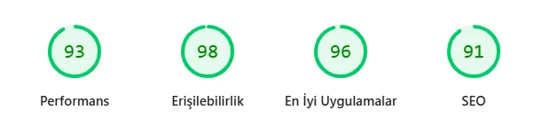
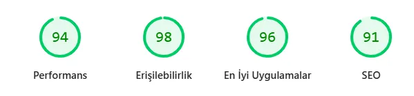
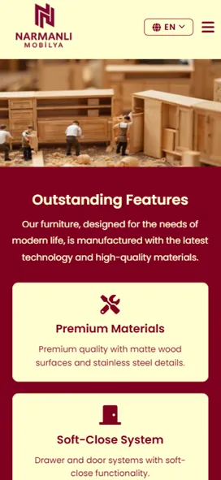
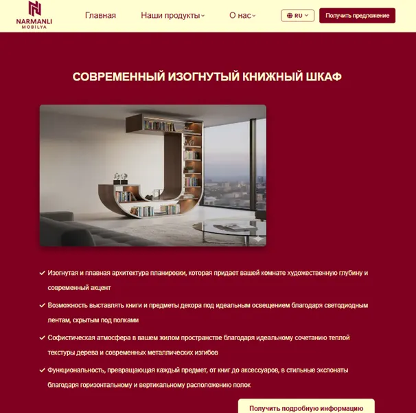
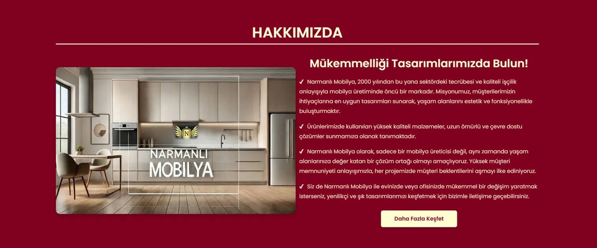

# 🛋️ Narmanlı Mobilya - Web Tasarım Projesi

Modern, hızlı ve kullanıcı deneyimi odaklı bir mobilya mağazası arayüz çalışması. Bu proje, kullanıcıların en çok mobil cihazlardan erişim sağladığı göz önünde bulundurularak **"Mobile-First" (Önce Mobil)** yaklaşımıyla geliştirilmiştir.

## 🛠️ Kullanılan Teknolojiler
Proje, saf web teknolojileri kullanılarak performans odaklı inşa edilmiştir:
* **HTML5:** Semantik yapı ve SEO uyumlu etiketleme.
* **CSS3:** Responsive tasarım ve modern düzen yapıları.
* **JavaScript (ES6+):** Dinamik dil değişimi ve interaktif bileşenler.

## 🌍 Dil Seçenekleri (Multi-Language)
Sistem, JSON tabanlı dinamik bir yapı ile 3 farklı dilde hizmet vermektedir:
* 🇹🇷 **Türkçe** | 🇬🇧 **English** | 🇷🇺 **Русский**

## 🚀 Performans Skorları (Lighthouse)
Web sitesi, hız ve SEO optimizasyonları sayesinde yüksek skorlar elde etmiştir:

### 📱 Mobil Performans

### 💻 Masaüstü Performans

## 📸 Ekran Görüntüleri (Responsive Design)
Projenin farklı cihazlardaki görünümü:

| Mobil | Tablet | Masaüstü |
| :---: | :---: | :---: |
|  |  |  |

---

# 🛋️ Narmanlı Furniture - Web Design Project

A modern, high-speed, and user-centered furniture store interface. This project was developed with a **"Mobile-First"** approach, prioritizing the seamless experience of users on mobile devices.

## 🛠️ Tech Stack
The project is built using vanilla web technologies with a focus on performance:
* **HTML5:** Semantic structure and SEO-friendly tagging.
* **CSS3:** Responsive design and modern layout techniques.
* **JavaScript (ES6+):** Dynamic multi-language support and interactive UI components.

## 🌍 Multi-Language Support
The system provides dynamic content in 3 languages via JSON-based architecture:
* 🇹🇷 **Turkish** | 🇬🇧 **English** | 🇷🇺 **Russian**

## 🚀 Performance Metrics (Lighthouse)
The application is highly optimized for speed and SEO, achieving top-tier industry scores:

### 📱 Mobile Performance
> **Note:** Optimization started from mobile screens to ensure the best performance for on-the-go users.

### 💻 Desktop Performance

## 📸 Responsive Showcase
Visual representation across different screen sizes:

| Mobile | Tablet | Desktop |
| :---: | :---: | :---: |
|  |  |  |
